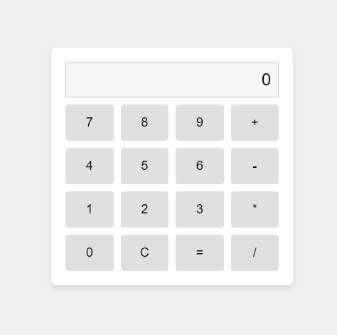

# Simple Calculator

A basic calculator application that performs arithmetic operations such as addition, subtraction, multiplication, and division.

## Creating a simple calculator using HTML, CSS, and JavaScript was a fantastic learning experience for me. Here are some key takeaways from this project:

- **Hands-on DOM Manipulation**: I gained practical skills in manipulating HTML elements using JavaScript to build an interactive user interface.

- **Mastering Event Handling**: I learned how to use event listeners like onclick to respond to user actions effectively, especially on the calculator buttons.

- **Building Programming Logic**: Implementing the core logic for basic operations such as addition, subtraction, multiplication, and division was challenging yet rewarding.

- **Managing Application State**: Understanding how to manage and update the state of the calculator as users input numbers and operations was crucial for maintaining functionality.

- **Enhancing User Interface with CSS**: Styling the calculator interface with CSS not only improved its visual appeal but also reinforced my understanding of CSS principles.

- **Problem-Solving Skills**: Overcoming challenges such as handling division by zero errors sharpened my problem-solving abilities and taught me to anticipate edge cases.

- **Documenting and Sharing**: Creating a README.md file to document the project details and share insights with others helped me organize my thoughts and showcase my work effectively.

- **Continuous Learning and Improvement**: This project highlighted areas where I can continue to grow, whether it's refining the user experience or expanding the calculator's functionality in future iterations.

  **Overall, building this calculator was a valuable learning journey that strengthened my foundational skills in web development and inspired me to tackle more complex projects in the future**.

## Technologies Used

- HTML
- CSS
- JavaScript

## Features

- **Basic Arithmetic Operations**: Perform addition, subtraction, multiplication, and division.
- **Clear Button**: Reset the calculator display.
- **Error Handling**: Display an error message for division by zero.
- **Responsive Design**: Simple and responsive layout.

## Screenshots



## Demo

You can try out the calculator live [here](https://marylindsen.github.io/calculator/).
## Getting Started

To run the calculator locally:

1. Clone this repository:
   ```bash
   git clone https://github.com/MaryLindsen/simple-calculator.git

